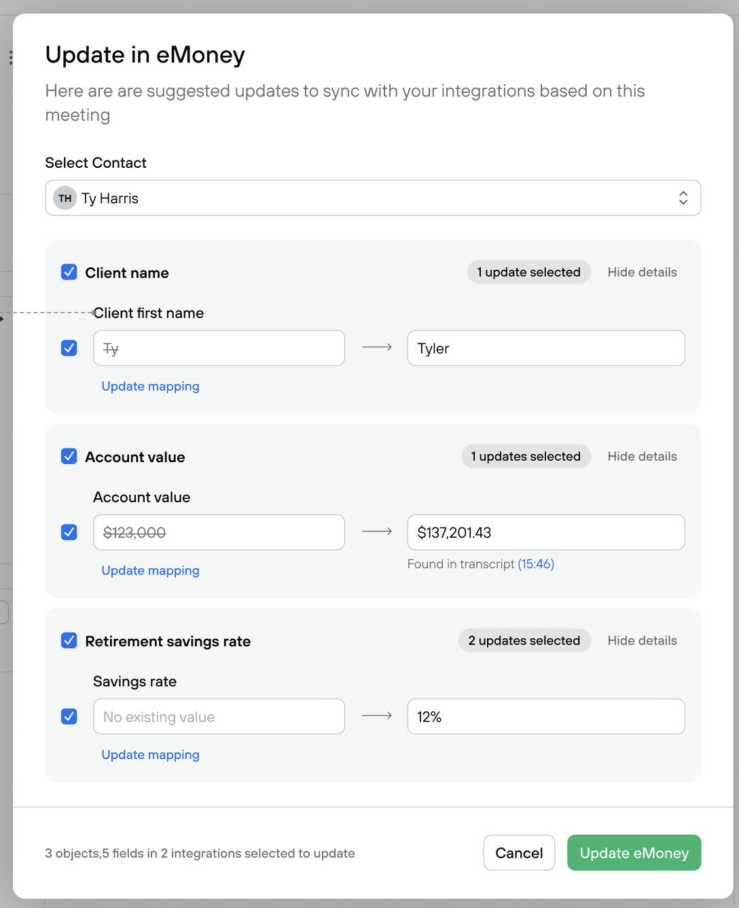
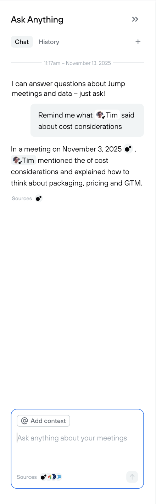

### New feature to add

- In settings, allow me to connect Salesforce using OAuth (keep in mind we’ll probably add more CRMs in the future)
    - Create a Salesforce OAuth app / “Connected App” for OAuth. There are public docs, multiple sandbox types and free Developer Edition orgs.
- After you record a new meeting:
    - Allow me to open a modal where I can review suggested updates to a Salesforce contact
    - Show a search/select where I can search for a Salesforce contact
    - Use the Salesforce API to pull the contact record
    - Use AI to generate a list of suggested updates to the Salesforce record
        - For example, if the user mentioned “My phone number is 8885550000 it suggests updating their phone number in the CRM”
    - It should show the existing value in Salesforce and the AI suggested update to the field
        
        
        
    - After reviewing the updates, I can click “Update Salesforce” and it will sync the updates to the selected Salesforce contact.
- Allow me to ask questions about contacts in both Hubspot or Salesforce using a chat interface (This is a chance to show off your front-end skills)
    - Allow me to type a question, tag a contact in the message, and it’ll answer the question from information the CRM (Salesforce OR Hubspot depending on which is connected)
    - The UI for reviewing and submitting updates should look exactly like this. We’d like to see your ability to match a design perfectly.
        
        
        

The app should have good tests check existing and mimic and build on top

### BONUS

update docs and make it easier for the next person to work on
clean up code that was messy or hard to understand any suggestions must be manually reviewed
we should “make the change easy, then make the easy change?”
